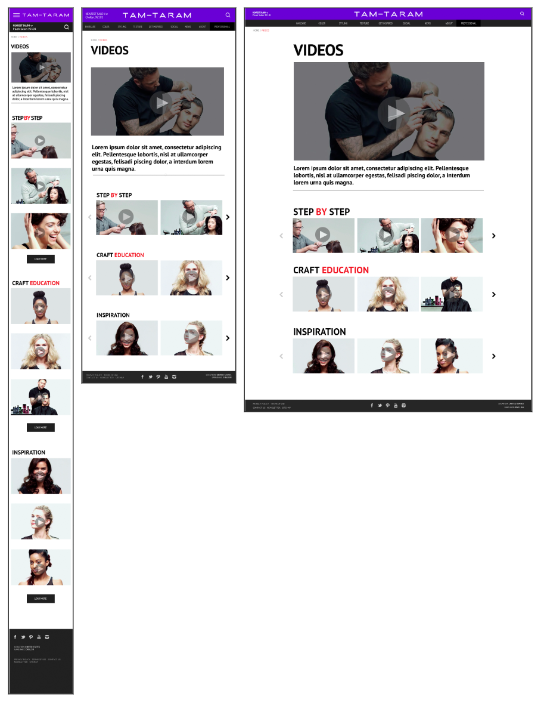

# TAM-TARAM Project Template
Сверстайте страничку. Аккуратно, качественно и адаптивно.



## Макеты
[Архив с макетами](https://yadi.sk/d/GJ7FD6dM3JiTkC) для мобильных, планшетов и десктопов.

В архиве вы найдете:

* 3 файла PSD
* 3 файла PNG с превьюшками макетов
* Необходимые иконки в SVG.

## Порядок работы
### Оценка
Перед тем, как приступить к задаче, оцените ее по времени и отправьте письмо с оценкой тому, от кого вы ее получили. Пример оценки: задача займет `N` часов, решение смогу прислать такого-то числа.

### Работа с кодом
**Не форкайте этот репозиторий!**

Скачайте или склонируйте код на свой компьютер, из него создайте репозиторий в своем Гитхаб-аккаунте и выполните задачу в нем.

## Запуск проекта
```bash
> npm install # установите зависимости
> npm start   # запустите сборку
```

Проект должен открыться в вашем браузере по адресу `http://localhost:3000`.

## Слайдер
Картинки в слайдере должны [грузиться с Ютюба](http://stackoverflow.com/questions/2068344/how-do-i-get-a-youtube-video-thumbnail-from-the-youtube-api?answertab=votes#tab-top).

По клику на картинку должен открываться попап с видео (можно использовать [FancyBox](http://fancyapps.com/fancybox/3/)). Видео должно начинать проигрываться при открытии.

Заголовки слайдеров и ролики:

```
STEP BY STEP
https://youtu.be/z8M0Fa1JVco
https://youtu.be/Wi2KcdoCuo4
https://youtu.be/8H6dYUgQKB8
https://youtu.be/PZjGrmHdFME
https://youtu.be/_wLGr24VeoI
https://youtu.be/DG4FAU5qmMY

CRAFT EDUCATION
https://youtu.be/RmNWNLXmswk
https://youtu.be/-tztXOz8Vc0
https://youtu.be/kUfIVtyydgQ

INSPIRATION
https://youtu.be/VmmwwzR536g
https://youtu.be/vz0k8O-Ef9Y
https://youtu.be/6oPBFnsqJW8
```

## Требования
* Именование классов по [БЭМ](https://oggetto-academy.github.io/frontend-handbook/bem/).
* Шаблонизатор [EJS](https://github.com/mde/ejs).
* Из библиотек можно использовать только jQuery, [FancyBox](http://fancyapps.com/fancybox/3/) и [Slick](http://kenwheeler.github.io/slick/). Либо все напиать руками на чистом JS. Другие варианты не рассматриваются. Библиотеки уже подключены с CDN.
* Адаптивность. В `src/less/media.less` есть переменные, используйте их либо добавьте свои. Используйте подход [mobile first](http://academy.oggettoweb.com/learn/rwd).
* Код должен соответствовать стандартам. В проекте имеются `ESLint`, `Stylelint` и `Editorconfig`.
* Макет должен хорошо работать в Хроме последней версии. Используйте [инструменты разработчика для эмуляции разных девайсов](https://developers.google.com/web/tools/chrome-devtools/device-mode/).

Вам могут пригодиться материалы из [Учебника по фронтенд-разработке](https://oggetto-academy.github.io/frontend-handbook/).